# JEPA-WMs: What drives success in physical planning with Joint-Embedding Predictive World Models?
[[`ArXiv`]()] [[`BibTeX`](#citing-jepa-wms)]
`TODO`

**[Meta AI Research, FAIR](https://ai.facebook.com/research/)**

[Basile Terver](https://x.com/BasileTerv987),
Jimmy Yang,
Jean Ponce,
Adrien Bardes,
Yann Le Cun

PyTorch implementation and pretrained models for JEPA-WMs. For details, see [**What drives success in physical planning with Joint-Embedding Predictive World Models?**](). This repository contains the code and models to reproduce the paper.

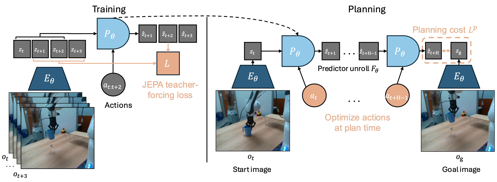

## Pretrained models

We provide pretrained JEPA-WM, [DINO-WM](https://arxiv.org/abs/2411.04983) and [V-JEPA-2-AC(fixed)](https://arxiv.org/abs/2506.09985) baseline models for various environments.

### JEPA-WM Models

| Environment | Resolution | Encoder | Pred. Depth | Weights |
|-------------|------------|---------|-----------------|---------|
| DROID & RoboCasa | 256×256 | DINOv3 ViT-S/16 | 6 | [download](https://dl.fbaipublicfiles.com/jepa-wms/jepa_wm_droid.pth) |
| Metaworld | 256×256 | DINOv3 ViT-S/16 | 6 | [download](https://dl.fbaipublicfiles.com/jepa-wms/jepa_wm_metaworld.pth) |
| Push-T | 224×224 | DINOv2 ViT-S/14 | 6 | [download](https://dl.fbaipublicfiles.com/jepa-wms/jepa_wm_pusht.pth) |
| PointMaze | 224×224 | DINOv2 ViT-S/14 | 6 | [download](https://dl.fbaipublicfiles.com/jepa-wms/jepa_wm_pointmaze.pth) |
| Wall | 224×224 | DINOv2 ViT-S/14 | 6 | [download](https://dl.fbaipublicfiles.com/jepa-wms/jepa_wm_wall.pth) |

### DINO-WM Baseline Models

| Environment | Resolution | Encoder | Pred. Depth | Weights |
|-------------|------------|---------|-----------------|---------|
| DROID & RoboCasa  | 224×224 | DINOv2 ViT-S/14 | 6 | [download](https://dl.fbaipublicfiles.com/jepa-wms/dino_wm_droid.pth) |
| Metaworld | 224×224 | DINOv2 ViT-S/14 | 6 | [download](https://dl.fbaipublicfiles.com/jepa-wms/dino_wm_metaworld.pth) |
| Push-T | 224×224 | DINOv2 ViT-S/14 | 6 | [download](https://dl.fbaipublicfiles.com/jepa-wms/dino_wm_pusht.pth) |
| PointMaze | 224×224 | DINOv2 ViT-S/14 | 6 | [download](https://dl.fbaipublicfiles.com/jepa-wms/dino_wm_pointmaze.pth) |
| Wall | 224×224 | DINOv2 ViT-S/14 | 6 | [download](https://dl.fbaipublicfiles.com/jepa-wms/dino_wm_wall.pth) |

### V-JEPA-2-AC(fixed) Baseline Model

| Environment | Resolution | Encoder | Pred. Depth | Weights |
|-------------|------------|---------|-----------------|---------|
| DROID & RoboCasa | 256×256 | V-JEPA-2 ViT-G/16 | 6 | [download](https://dl.fbaipublicfiles.com/jepa-wms/vjepa2_ac_droid.pth) |

### Loading Models with PyTorch Hub

You can easily load pretrained models using PyTorch Hub:

```python
import torch

# Load our best pretrained JEPA-WMs
model, preprocessor = torch.hub.load('facebookresearch/jepa-wms', 'jepa_wm_droid')
model, preprocessor = torch.hub.load('facebookresearch/jepa-wms', 'jepa_wm_metaworld')
model, preprocessor = torch.hub.load('facebookresearch/jepa-wms', 'jepa_wm_pusht')
model, preprocessor = torch.hub.load('facebookresearch/jepa-wms', 'jepa_wm_pointmaze')
model, preprocessor = torch.hub.load('facebookresearch/jepa-wms', 'jepa_wm_wall')

# Load reproduced DINO-WM baseline models
model, preprocessor = torch.hub.load('facebookresearch/jepa-wms', 'dino_wm_droid')
model, preprocessor = torch.hub.load('facebookresearch/jepa-wms', 'dino_wm_metaworld')
model, preprocessor = torch.hub.load('facebookresearch/jepa-wms', 'dino_wm_pusht')
model, preprocessor = torch.hub.load('facebookresearch/jepa-wms', 'dino_wm_pointmaze')
model, preprocessor = torch.hub.load('facebookresearch/jepa-wms', 'dino_wm_wall')

# Load fixed V-JEPA-2-AC baseline models
model, preprocessor = torch.hub.load('facebookresearch/jepa-wms', 'vjepa2_ac_droid')
```

## Getting Started

### Environment Setup

The environment to run the codebase is straightforward to create using [`uv`](https://github.com/astral-sh/uv). If you don't have it, you can install it using:
```bash
curl -LsSf https://astral.sh/uv/install.sh | sh
```

Then clone the repository in the `JEPA_WM_HOME` (see [Path Configuration](#path-configuration)) with:
```bash
git clone git@github.com:facebookresearch/jepa-wms.git
cd jepa-wms
```

Once it is installed, you can create your environment using:
```bash
uv sync                # Install base dependencies
uv sync --extra dev    # Install base + dev dependencies
```

This environment can be activated using `. .venv/bin/activate`, and deactivated using `deactivate`. ou can also run Python scripts using the venv without activating it using `uv run script.py`.

### Path Configuration

To make the repository agnostic to specific cluster configurations, we use environment variables to configure dataset and checkpoint paths. **You must set these environment variables before running the code.**

1. **`DATASET_ROOT`**: Root directory where all datasets are stored
2. **`CHECKPOINT_ROOT`**: Root directory where checkpoints and experiment outputs will be saved
3. **`JEPA_WM_HOME`**: parent directory containing all repositories
4. **`PRETRAINED_CKPT_ROOT`**: Root directory where pretrained checkpoints are stored (e.g., DINOv3, V-JEPA, V-JEPA-2)

Add the following lines to your shell configuration file (e.g., `~/.bashrc`, `~/.zshrc`, or `~/.bash_profile`):

```bash
# JEPA-WMs Path Configuration
export DATASET_ROOT=</path/to/your/datasets>
export CHECKPOINT_ROOT=</path/to/your/checkpoints>
export JEPA_WM_HOME=</path/to/your/workspace>
export PRETRAINED_CKPT_ROOT=</path/to/your/pretrained_encoders>  # Optional
```
After adding these lines, reload your shell configuration:
```bash
source ~/.bashrc  # or ~/.zshrc, depending on your shell
```

Once you set `JEPA_WM_HOME`, you will have to organize your cloned repositories as follows (see below instructions on [installing Robocasa](#optional-robocasa-install) and [Downloading pretrained encoders](#downloading-pretrained-encoders)):
```
$JEPA_WM_HOME/
├── jepa-wms/          # This repository
├── dinov3/            # DINOv3 repository
├── robocasa/          # RoboCasa repository
└── robosuite/         # RoboSuite repository
```

### Downloading pretrained encoders

Once you set `PRETRAINED_CKPT_ROOT`, organize your pretrained checkpoints as follows :

```
$PRETRAINED_CKPT_ROOT/
├── dinov3/                # DINOv3 checkpoints
│   ├── dinov3_vits16_pretrain_lvd1689m.pth
│   └── dinov3_vitl16_pretrain_lvd1689m-<your-hashkey>.pth
├── vjepa1_opensource/     # V-JEPA v1 checkpoints
│   └── vitl16.pth.tar
├── vjepa2_opensource/     # V-JEPA v2 checkpoints
│   ├── vjepa2_vit_large.pth
│   └── vjepa2_vit_giant.pth
```

To download pretrained encoders, follow the instructions from their respective repositories:

- **DINOv3**: Follow instructions at [dinov3](https://github.com/facebookresearch/dinov3) to download DINOv3 checkpoints. To reproduce our paper, you only need to download the [ViT-S/16 distilled](https://ai.meta.com/resources/models-and-libraries/dinov3-downloads/). You will receive an e-mail with downloading urls. Place the downloaded checkpoint(s) in `$PRETRAINED_CKPT_ROOT/dinov3/`. You should also `git clone git@github.com:facebookresearch/dinov3.git` inside `JEPA_WM_HOME`. Optional: If you want to use the ViT-L/16 encoder, you should replace the hashkey `pretrain_lvd1689m-<your-hashkey>.pth` with yours in `app/plan_common/models/dino.py`

- **V-JEPA**: Follow instructions at [vjepa](https://github.com/facebookresearch/jepa) to download V-JEPA v1 checkpoints. You only need the [ViT-L/16](https://dl.fbaipublicfiles.com/jepa/vitl16/vitl16.pth.tar) to reproduce our paper. Place the downloaded checkpoints in `$PRETRAINED_CKPT_ROOT/vjepa1_opensource/`.

- **V-JEPA-2**: Follow instructions at [vjepa2](https://github.com/facebookresearch/vjepa2) to download V-JEPA-2 checkpoints. You only need the [ViT-L/16](https://dl.fbaipublicfiles.com/vjepa2/vitl.pt) to reproduce our paper and need the [ViT-G/16](https://dl.fbaipublicfiles.com/vjepa2/vitg.pt) to reproduce the V-JEPA-2-AC baseline. Place the downloaded checkpoints in `$PRETRAINED_CKPT_ROOT/vjepa2_opensource/`.

### MuJoCo 2.1 for PointMaze (mujoco-py)

The PointMaze environment uses `d4rl`, which depends on `mujoco-py`, which requires a system-level MuJoCo 2.1.0 installation.
Other environments (Push-T, Wall, Metaworld, RoboCasa) use the modern `mujoco` package and do not require this setup.

1. **Download and extract MuJoCo 2.1.0**:
   ```bash
   mkdir -p ~/.mujoco
   wget https://mujoco.org/download/mujoco210-linux-x86_64.tar.gz -P ~/.mujoco/
   cd ~/.mujoco
   tar -xzvf mujoco210-linux-x86_64.tar.gz
   ```

2. **Set environment variables** by adding these lines to your `~/.bashrc` (or `~/.zshrc`):
   ```bash
   # MuJoCo 2.1.0 for mujoco-py
   export LD_LIBRARY_PATH=$LD_LIBRARY_PATH:$HOME/.mujoco/mujoco210/bin
   # NVIDIA Library Path (if using NVIDIA GPUs)
   export LD_LIBRARY_PATH=$LD_LIBRARY_PATH:/usr/lib/nvidia
   ```

3. **Reload your shell configuration**:
   ```bash
   source ~/.bashrc  # or ~/.zshrc
   ```

4. **Verify the installation**:
   ```bash
   python -c "import mujoco_py; print('mujoco-py works!')"
   ```

### Optional: Robocasa install

For robot manipulation environments (RoboCasa, RoboSuite), you need to manually install these dependencies from source, as they cannot be installed via pip alone.

1. **Install RoboSuite** (use the `robocasa-dev` branch):
   ```bash
   git clone https://github.com/Basile-Terv/robosuite.git
   cd robosuite
   git checkout robocasa-dev
   uv pip install -e .
   cd ..
   ```

2. **Install RoboCasa**:
   ```bash
   git clone https://github.com/Basile-Terv/robocasa.git
   cd robocasa
   uv pip install -e .

   # Optional: set up code formatter
   uv pip install pre-commit
   pre-commit install

   # If you encounter issues with numba/numpy, run:
   # conda install -c numba numba=0.56.4 -y
   ```

3. **Download RoboCasa assets and setup**:
   ```bash
   python robocasa/scripts/download_kitchen_assets.py   # Caution: Assets are around 5GB
   python robocasa/scripts/setup_macros.py              # Set up system variables
   cd ..
   ```

**Note**: If you're not using `uv`, replace `uv pip install` with `pip install` in the commands above.

### Downloading Data

Our experiments use datasets from multiple sources. Below are instructions for obtaining and setting up each dataset. We remind that you should have **set the environment variable** `export DATASET_ROOT=</path/to/your/datasets>`.

Once you have set `DATASET_ROOT`, you can follow the below instructions per dataset to organize your datasets as follows:

```
$DATASET_ROOT/
├── pusht_noise/           # Push-T dataset
├── point_maze/            # PointMaze dataset
├── wall_single/           # Wall dataset
├── Metaworld/             # Metaworld dataset
│   └── train_paths.csv
├── robocasa/              # RoboCasa dataset
│   └── combine_all_im256.hdf5
├── droid/                 # DROID dataset
│   ├── droid_train_paths.csv
│   └── droid_val_paths.csv
├── kinetics400/           # Kinetics-400 dataset (optional)
│   ├── k400_train_paths.csv
│   └── k400_val_paths.csv
├── kinetics710/           # Kinetics-710 dataset (optional)
│   ├── k710_train_paths.csv
│   └── k710_val_paths.csv
├── ssv2/                  # Something-Something-v2 dataset (optional)
│   ├── ssv2_train_paths.csv
│   └── ssv2_val_paths.csv
└── howto100m/             # HowTo100M dataset (optional)
    └── howto100m_paths.csv
```

#### Push-T, Wall, and PointMaze

For these environments, we use datasets from the [DINO-WM project](https://osf.io/bmw48/?view_only=a56a296ce3b24cceaf408383a175ce28).

1. **Download the datasets** from [this link](https://osf.io/bmw48/?view_only=a56a296ce3b24cceaf408383a175ce28).

2. **Extract the datasets**: Unzip the downloaded files.

**Note**: We do not use the deformable data from DINO-WM.

#### Metaworld

For Metaworld, we create a custom dataset by training [TD-MPC2](https://github.com/nicklashansen/tdmpc2) online agents and collecting the first 100 episodes from each of the 42 tasks considered in our experiments.

#### DROID

Download the DROID dataset following the [instructions](https://droid-dataset.github.io/droid/the-droid-dataset). This requires `uv pip install gsutil`.
We only use the left camera and not the SVO cam files hence you can run the second of the two below commands to obtain the raw dataset of full-HD resolution (720 x 1280) MP4 files.
```bash
# Raw DROID dataset in stereo HD, stored as MP4 videos (8.7TB)
gsutil -m cp -r gs://gresearch/robotics/droid_raw <path_to_your_target_dir>
# Raw DROID dataset, non-stereo HD video only (5.6TB, excluding stereo video & raw SVO cam files)
gsutil -m rsync -r -x ".*SVO.*|.*stereo.*\.mp4$" "gs://gresearch/robotics/droid_raw" <path_to_your_target_dir>
```

After downloading, generate the paths CSV file required by the dataloader:
```bash
python src/scripts/generate_droid_paths.py \
    --droid_root <path_to_your_target_dir>/droid_raw/1.0.1 \
    --output_path $DATASET_ROOT/DROID/droid_paths.csv \
    --num_workers 16 \
```

This script scans the dataset directory structure in parallel and creates a CSV file listing all valid episode paths.

#### RoboCasa

For RoboCasa, download the trajectories from the following URL:

`TODO: Add RoboCasa dataset URL`


## Training

### Plan_common app

This app regroups datasets, basic architecture modules (for ViTs mostly) and data preprocessing logic.

### V-JEPA-WM app
This generic app covers the DINO-WM method and offers other possibilities in terms of training objective, architecture, datasets (Metaworld).

Launch training of models of the paper with

```python -m app.main --fname configs/vjepa_wm/<env>_sweep/<env>_4f_fsk5_ask1_r224_pred_dino_wm_depth6_noprop_repro_1roll_save.yaml```

Replace `<env>` with your target environment (e.g., mw, wall, mz).

You can also train heads by launching for example, for DINOv2 ViT-B:
```python -m app.main --fname configs/vjepa_wm/<env>/step2_<env>_state_head_dinovitb_r224.yaml```
or
```python -m app.main --fname configs/vjepa_wm/<env>/step2_<env>_vitbdec_dinovitbenc_224_beta0.95.yaml```

Those heads can then be used by the online ***light evals***, performed in the val_rollout() function of the training loops of both dino_wm and vjepa_wm.

This app covers:
- DINO-WM with the configs `configs/vjepa_wm/<env>_sweep/<env>_4f_fsk5_ask1_r224_pred_dino_wm_depth6_repro_1roll_save.yaml`
- Our best JEPA-WMs with
  - `mw_sweep/mw_4f_fsk5_ask1_r256_dv3vits_vjtranoaug_pred_AdaLN_ftprop_depth6_repro_2roll_save`
  - `mz_sweep/mz_4f_fsk5_ask1_r224_vjtranoaug_predAdaLN_ftprop_depth6_repro_2roll_save_2n`
  - `pt_sweep/pt_4f_fsk5_ask1_r224_vjtranoaug_predAdaLN_ftprop_depth6_repro_2roll_save`
  - `wall_sweep/wall_4f_fsk5_ask1_r224_vjtranoaug_predAdaLN_ftprop_depth6_repro_2roll_save_2n`
  - `droid_final_sweep/droid_4f_fps4_r256_dv3vits_vjtranoaug_pred_AdaLN_depth6_repro_2roll_4fpcs_2n` for Robocasa
  - `droid_final_sweep/droid_4f_fps4_r256_dv3vits_vjtranoaug_pred_AdaLN_depth6_noprop_repro_2roll_4fpcs_2n` for DROID offline eval


## Evaluation

### Config generation
In the train.py script of both the vjepa_wm and dino_wm apps, you can uncomment the highlighted snippet in launch_planning_evals() to stop to breakpoint after having generated the planning eval configs of the model.
Then run in debug mode for example
```python -m app.main --fname configs/vjepa_wm/<env>_sweep/<env>_4f_fsk5_ask1_r224_pred_dino_wm_depth6_noprop_repro_1roll_save.yaml --debug```.

This will dump the generated yaml files in `configs/dump_online_evals/vjepa_wm` or `configs/dump_online_evals/dino_wm`.

To launch planning evaluation with, for example, the generated config for a goal source that is from the dataset (dset), with a planner based on NeverGrad (ng), using the L_2 latent distance as planning objective, do

```python -m evals.main --fname configs/dump_online_evals/vjepa_wm/dset_ng_L2.yaml```

or

```python -m evals.main_distributed --fname configs/dump_online_evals/vjepa_wm/dset_ng_L2.yaml --account fair_amaia_cw_video --qos lowest --time 120```

### Grid evaluation
To run evaluations across multiple hyperparameters (planners, objectives, epochs, task variants), use `run_eval_grid.py` to generate a batch of configs from a template:
```bash
python -m evals.simu_env_planning.run_eval_grid \
    --env metaworld \
    --config configs/dump_online_evals/vjepa_wm/dset_ng_L2.yaml \
```

This generates configs for all combinations of variants, planners (`ng`/`cem`), objectives (`L1`/`L2`), and epochs. Use `--planner`, `--objective`, or `--variant` to filter. The script outputs a batch launch command for distributed evaluation.

The notebook to visualise these planning eval results is `app/plan_common/notebooks/logs_planning_joint.ipynb`.

# Simu_env_planning eval

## Overview
In this evaluation, we perform goal-conditioned trajectory optimization. We optimize over the action space to minimize the below cost, denoted $C$ (where the $\hat{z}$ sequence is defined recursively):
$$
C(a, s_0, s_g) = \sum_{t=0}^H \| E_{\theta}(s_g) - P_{\theta}(\hat{z}_t, a_t) \|_2, \\
\hat{z}_0 = E_{\theta}(s_0), \quad \hat{z}_{t+1} = P_{\theta}(\hat{z}_t, a_t), \quad t=0,\dots, H.
$$

We define an **evaluation episode** as a pair $(s_0, s_g)$, the *task definition* along with the *plan* outputted by our agent and planning procedure, and whether this leads to $s_g$, i.e. **Success** or not, i.e. **Failure**.

### Goal sources
We have 4 potential goal sources supported:
- **dset**: the initial and goal state are sampled from the validation set. Used for Push-T, Robocasa and DROID. The **random_actions** variant steps actions sampled from a Gaussian from the initial state sampled in the trajectory.
- **expert**: for Metaworld, starting from a randomly sampled initial state, we play the expert policy provided with the environment to get an expert trajectory and goal state.
- **random_state**: For Maze and Wall, the 2D position of the initial and goal state are sampled with a function built in the simulator.
For tasks where `goal_source != random_state`, we can thus store an *expert trajectory*, leading from the initial to the goal state.


### Episode Metrics
This evaluation outputs the following metrics:
- **Success Rate**: the percentage of success across the `cfg.meta_eval_episodes` evaluation episodes.
-  Distance to goal at end of episode (`ep_end_dist`)
-  For Metaworld, Maze, Push-T and Wall: the average cumulative reward over the episodes (`reward`), as defined in the simulator.
-  For Metaworld, log whether the arm has reached the target location, regardless of the objects involved in the success definition (`success_dist`)
- For tasks where `goal_source != random_state`, unroll the world model on the expert actions, compute between the visual states hereby produced and those produced by unrolling the plan outputted by the agent:
  - the L2 distance between respective visual embeddings (`total_emb_l2`)
  - the LPIPS between respective visual decodings (`total_lpips`)
-  For DROID offline planning only, we also track:
   -  `end_distance_xyz`: distance to goal end-effector orientation
   -  `end_distance_orientation`: distance to goal end-effector orientation
   -  `end_distance_closure`: distance to goal gripper closure

### Optional episode analysis plots

The eval optionally produces the following plots for each eval episode if `cfg.logging.optional_plots`, using the functions in `evals/simu_env_planning/planning/episode_plot_utils.py`. We display an example figure of a Robocasa evaluation episode for each of the below plots.
- `state.pdf`: the initial and goal images $s_0$ and $s_g$ used for the *task definition*.
- `video_agent_goal_{success}.gif`: GIF of the episode, after stepping the planned actions in the environment.
- `expert_video.gif`: if `goal_source in ["dset", "expert"]` GIF of the expert trajectory stepped in the environment.

| State | Expert video | Agent success video |
|------------|-------------|---------------|
| 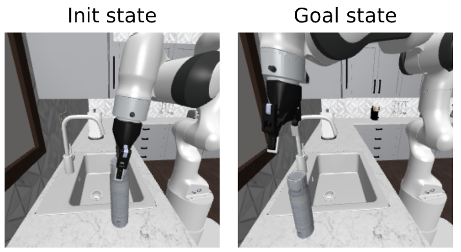 | 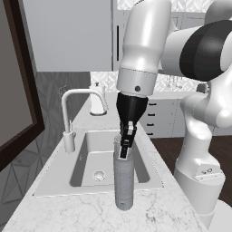|  |

- `losses.pdf`: For each timestep of the episode where the agent plans, track the planning cost $C$ throughout iterations of the planning optimizer.
- `action_comparison.pdf`: comparison, for each action dimension, of the value outputted by the agent and the one of the expert, throughout episode timesteps.

Planning costs | Actions comparison to expert actions|
|-------------|---------------|
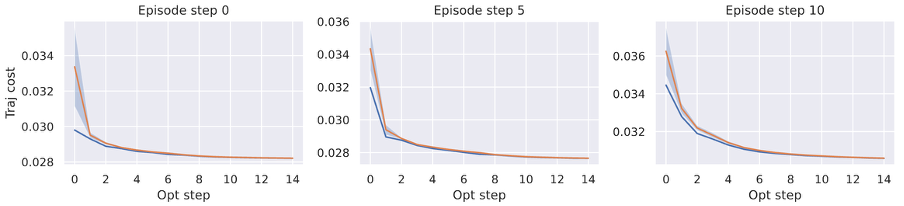| 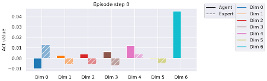 |

- `agent_rep_distance_visual.pdf` and `expert_rep_distance_visual.pdf`: visual embedding $L_2$ distance throughout timesteps stepped by the agent in the env and the goal visual embedding.
- `agent_rep_distance_proprio.pdf` and `expert_rep_distance_proprio.pdf`: proprioceptive embedding $L_2$ distance throughout timesteps stepped by the agent in the env and the goal proprioceptive embedding.
- `agent_objectives` and `expert_objectives`: planning objective $C$ of successive timesteps stepped by the agent in the env.
- `agent_distances.pdf` and `expert_distances`: cartesian distance of the agent (end-effector for Metaworld, DROID, and Robocasa) to the goal.

| | Expert | Agent |
|---|-------------|---------------|
Cartesian Distance |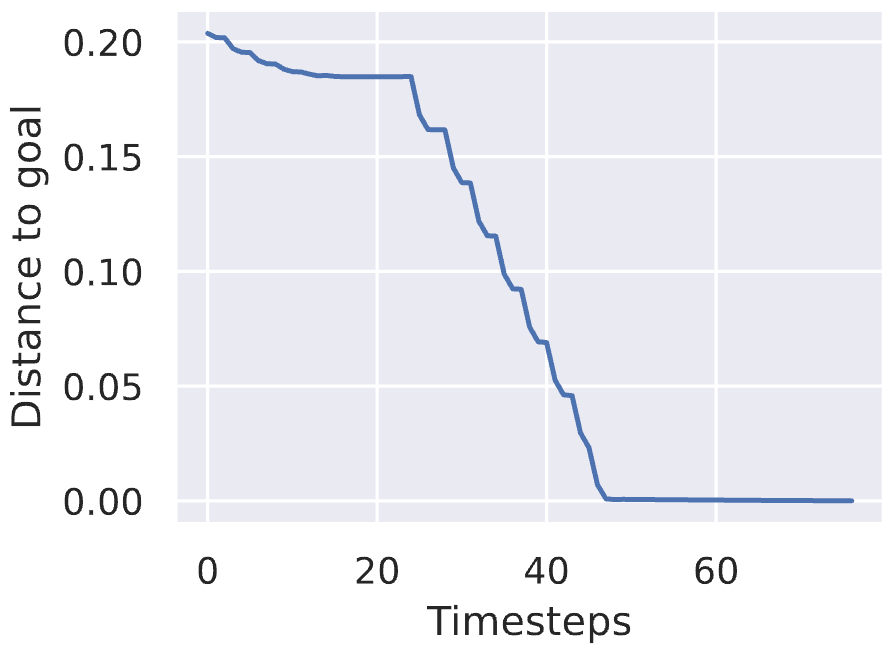| 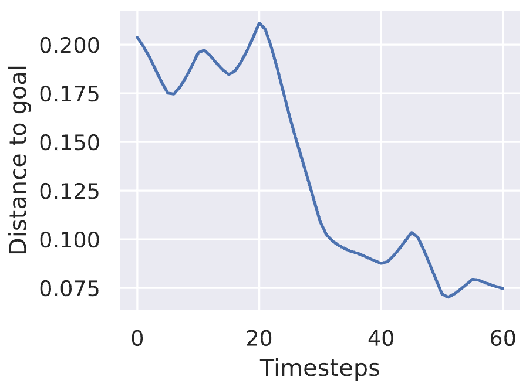 |
Representation Distance |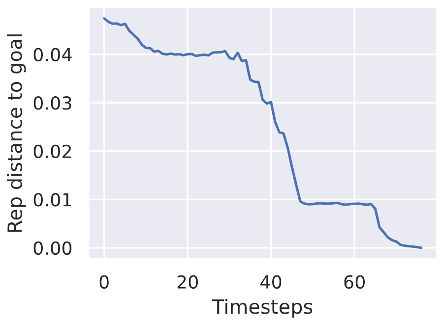| 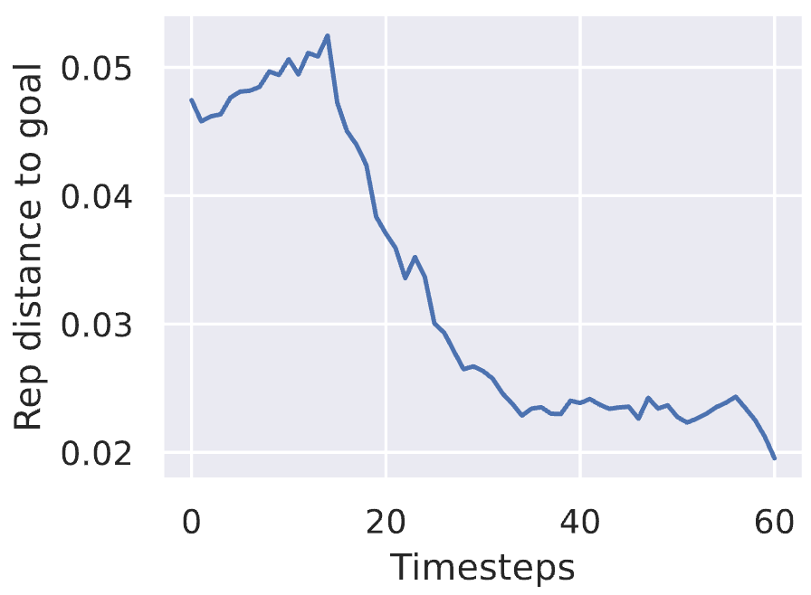 |

Moreover, if `cfg.planner.decode_each_iteration` we get the following plots:
- `step{k}.gif`, `step{k}_gt.pdf` and `step{k}_last_frames.pdf`: at each episode step where the agent plans, the GIF displays the best plan of each planning optimizer (e.g. CEM) iteration. `step{k}_last_frames.pdf` is the decoding of the unrolling of the actions outputted by the planning optimizer. `step{k}_gt.pdf` is the consequence of stepping this plan in the environment.

<table>
<tr>
<th>step0.gif</th>
<th>step0_last_frames</th>
<th>step0_gt</th>
</tr>
<tr>
<td>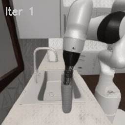</td>
<td>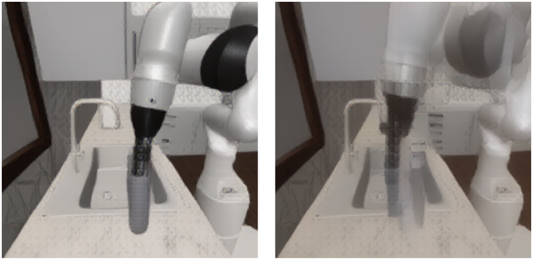</td>
<td>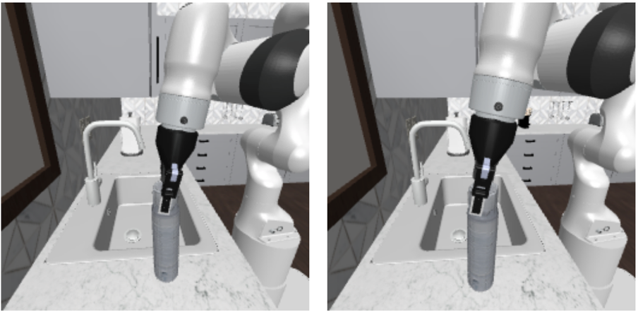</td>
</tr>
<tr>
<td></td>
<td colspan="2">Stepping of only the first action out of the H=3 actions planned, both in the env and in the world model's "imagination".</td>
</tr>
</table>

### Distributed episodes
This eval parallelizes by distributing independent episodes accross GPUs, via the `main_distributed_episodes_eval()` function in `evals/simu_env_planning/eval.py`.

### Planning optimization
It supports various:
- Planners (maintained ones are CEM and NeverGrad) at `evals/simu_env_planning/planning/planning/planner.py`
- Planning objectives at `evals/simu_env_planning/planning/planning/objectives.py`
- Goal sources: expert for Metaworld, random state or dset for Push-T, Wall and Maze. They are managed in the `set_episode()` function of `evals/simu_env_planning/planning/plan_evaluator.py`

### Model wrapper for planning
For this eval to be run, we require a wrapper, the default one being `app.vjepa_wm.modelcustom.simu_env_planning.vit_enc_preds.EncPredWM`.
In the wrapper, we initiliaze:
- the **world model** (encoder, predictor and optional other modules).

This wrapper requires prior loading, in in `evals/simu_env_planning/eval.py`, of:
- a **data_preprocessor**. It is used to normalize and denormalize the actions and the proprioception if we used normalize_action = True. We should use denormalization of planned actions outputted by the world model so they can be stepped in the associated simulator.
- the **validation set**. It is needed:
  - to determine the action and proprioception input dimensions
  - to determine the mean and std of actions and proprioception in the data proprocesor
  - to provide the data to define the planning task via the init and goal state $s_0$ and $s_g$ if `goal_source == dset`

## Eval Configs
You can find:
- Some full example configs at `configs/evals/simu_env_planning` to evaluate on the Metaworld, Robocasa envs or on offline DROID dataset trajectories.
- Some configs templates for the same environments to fill with your model kwargs at `evals/simu_env_planning/base_configs`

## Code Structure

```
.
├── app                              # training loops
│   ├── vjepa_wm                     #   train world model / heads
│   ├── main_distributed.py          #   entrypoint for sbatch on slurm
│   └── main.py                      #   entrypoint for local run
├── configs                          # config files
│   ├── dump_online_evals            #   generated eval cfgs from train loop
│   ├── evals                        #   pre-generated full eval cfgs
│   ├── online_plan_evals            #   eval cfg templates to fill with train cfg
│   ├── vjepa_wm                     #   train configs
├── evals                            # evaluations
│   ├── simu_env_planning            #   planning evaluation
│   ├── main_distributed.py          #   entrypoint for distributed evals
│   └── main.py                      #   entrypoint for local evals
├── src                              # the package
│   ├── datasets                     #   VM2M datasets, loaders (optional)
│   ├── models                       #   V-JEPA1/2 model definitions
│   ├── masks                        #   masking utilities (optional)
│   └── utils                        #   shared utilities
├── tests                            # unit tests for some modules

```

## Troubleshooting

### MuJoCo Rendering

If you encounter MuJoCo rendering errors during evaluation (especially on headless servers or clusters), you may need to configure the rendering backend by setting these environment variables before running your scripts:

```bash
# For systems with EGL support (e.g., NVIDIA GPUs with recent drivers)
export MUJOCO_GL=egl
export PYOPENGL_PLATFORM=egl

# For systems without EGL (e.g., CPU-only rendering)
export MUJOCO_GL=osmesa
export PYOPENGL_PLATFORM=osmesa
```

**When to use each backend:**
- **EGL**: Preferred for GPU-accelerated rendering on headless servers with NVIDIA GPUs and recent drivers. Provides better performance.
- **OSMesa**: Fallback option for CPU-based rendering when EGL is not available. Slower but more compatible.

**Common error messages:**
- `"ERROR: GLEW initialization error: Missing GL version"` → Try using `osmesa` backend
- `"Cannot initialize EGL"` → Try using `osmesa` backend or check GPU drivers
- Rendering appears blank or corrupted → Verify the correct backend for your system

## License

This project is licensed under the [CC-BY-NC 4.0 License](LICENSE) - see the LICENSE file for details.

For information about third-party components and their licenses, see [THIRD-PARTY-LICENSES.md](THIRD-PARTY-LICENSES.md).


## Citing JEPA-WMs
If you find this repository useful in your research, please consider giving a star :star: and a citation

`TODO`
```bibtex
@article{,
  title={},
  author={}
  journal={arXiv preprint arXiv},
  year={2025}
}
```
